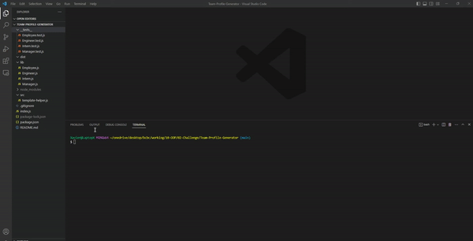
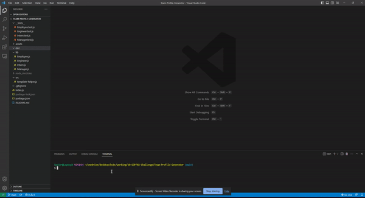
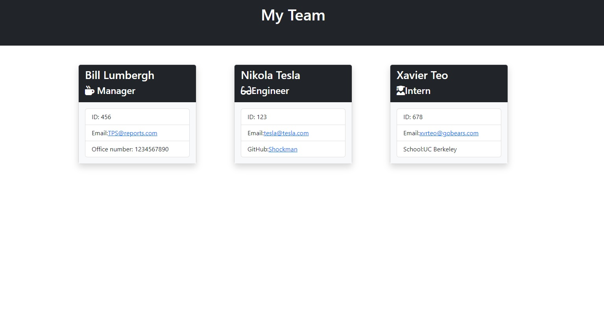

# Team-Profile-Generator

## Description

This is a Node.js command-line application that takes in information about employees on a software engineering team and generates an HTML webpage that displays summaries for each person.

## Usage

This application will allow the user to generate a team profile. First, clone the project and in the VS Code terminal, install the following packages with the following commands:

- npm i inquirer@8.2.4
- npm i jest

The application will start once the user types "node index.js" in the command-line.

## GIF Animations:

### Testing:

GIF link: https://gifyu.com/image/S7bGa
YouTube link: https://youtu.be/Ymf3Idg4KpY

### Generating HTML file:

GIF link: https://gifyu.com/image/S7bGf
YouTube link: https://youtu.be/CxGdBXhym1k

### Sample of generated HTML file (SAMPLE-team.html in assets directory):

### Links:

1. Testing: https://youtu.be/Ymf3Idg4KpY
2. Generating HTML file: https://youtu.be/CxGdBXhym1k
3. Sample HTML file is SAMPLE-team.html in assets directory
3. https://github.com/XvrTeo/Team-Profile-Generator
